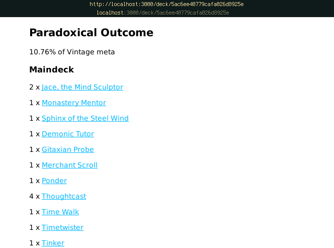

### MTGDB
This project was created in line with Launchcode's apprenticeship path, which suggests a full stack web application to demonstrate working knowledge of all aspects of development.
The frontend is a work in progress, and will likely employ either Angular or React.

A Database of Magic the Gathering Cards, searchable by a variety of attributes including:
* Name
* Color
* Rarity
* Type/Subtype
* Power/Toughness
* Converted Mana Cost

The card information is pulled in using the [mtg api](https://docs.magicthegathering.io/) and stored in a MongoDB database as a collection of card objects.

After the desired card is chosen, information for the card including all edition artwork, flavor text, and rules text is sent to the view from the server, 
as well as a list of all decks in the meta currently playing the card. This information is scraped from [mtggoldfish](http://www.mtggoldfish.com).

The linked decks can be followed, and information on the maindeck and sideboard, as well as the percentage of the meta taken by the deck, is sent to the view.
Each card listed in the deck leads back to a card view for more information on the card.

Card and deck information will be updated weekly from their respective sources.

#### Installation
    $ git clone https://github.com/Ethan-ks/mtgdb.git
    $ cd mtgdb
    $ npm install
    $ npm start
The express server runs on port 3000 on localhost by default.

#### Technologies
Database - [MongoDB](https://github.com/mafintosh/mongojs)

Server - [ExpressJS](https://expressjs.com/)

Database interaction - [promised-mongo](https://github.com/gordonmleigh/promised-mongo)
